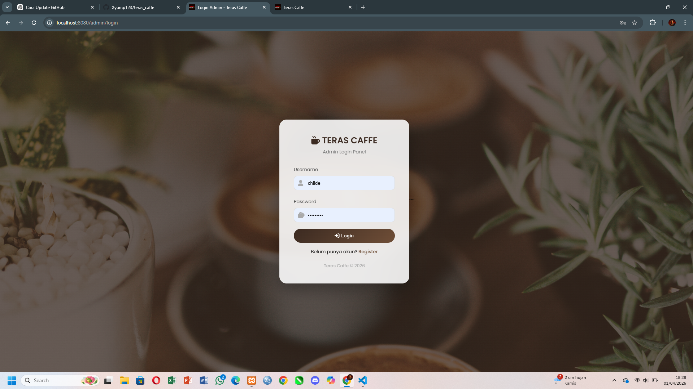
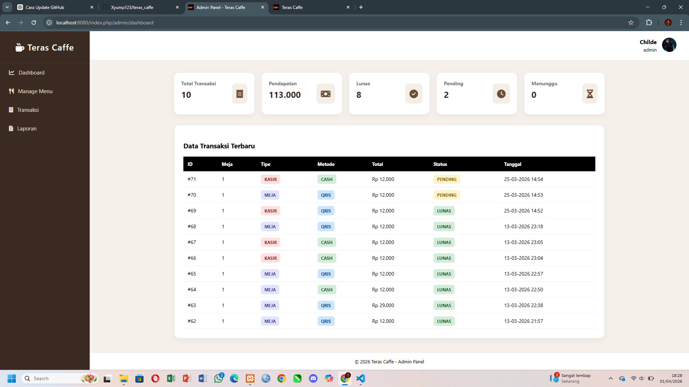
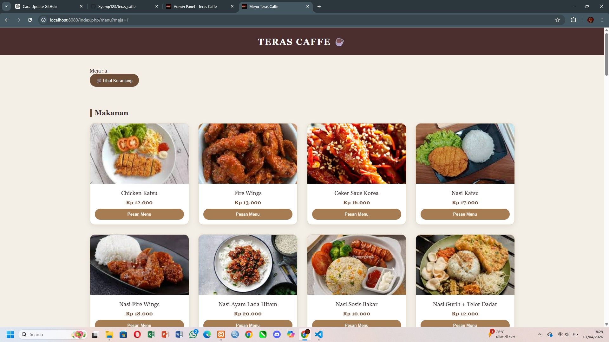
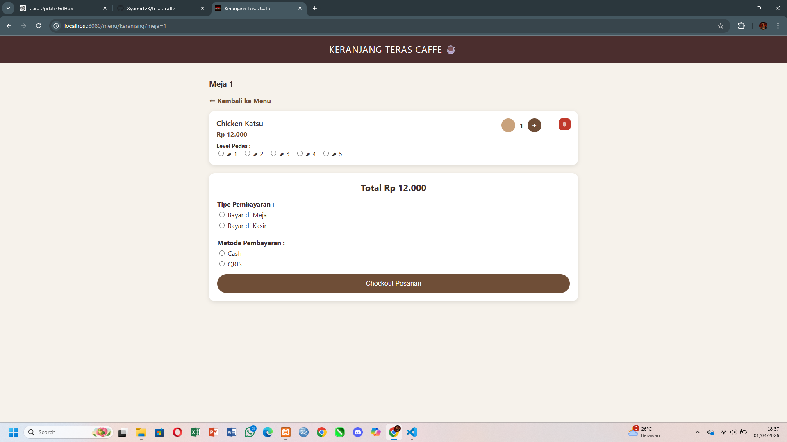
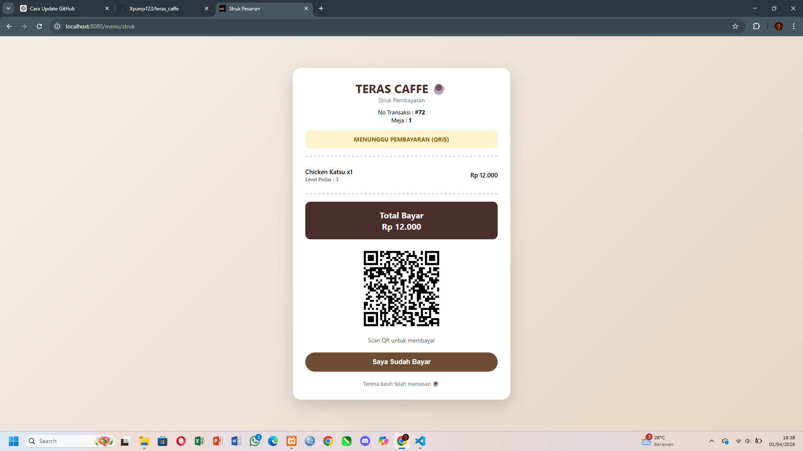
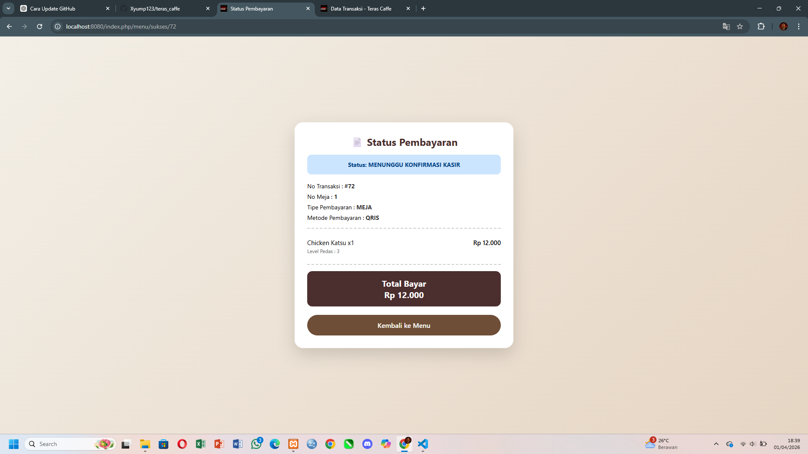

# ☕ Teras Caffe

Aplikasi pemesanan menu berbasis web yang memudahkan pelanggan dalam melakukan pemesanan serta membantu admin dalam mengelola data menu dan transaksi secara efisien.

---

## ✨ Fitur Utama

- 🔐 Login & Register Admin
- 📊 Dashboard Admin
- 🍽️ Manajemen Menu
- 🧾 Transaksi Pemesanan
- 🖨️ Cetak Struk

---

## 🛠️ Teknologi yang Digunakan

- PHP (CodeIgniter 4)
- MySQL
- HTML, CSS, Bootstrap

---

## 📸 Tampilan Aplikasi

### 🔐 Halaman Login

### 📊 Dashboard Admin

### 🍽️ Menu

### 🍽️ Keranjang

### 🧾 Transaksi

### 🧾 Struk

---

## 🚀 Cara Menjalankan Project

1. Clone repository ini
2. Jalankan XAMPP (Apache & MySQL)
3. Import database `teras_caffe.sql` ke phpMyAdmin
4. Atur file `.env` sesuai konfigurasi database
5. Jalankan project di browser: http://localhost/teras_caffe

---

## 🔗 Routing (Ringkasan)

- `/login` → Halaman login
- `/admin` → Dashboard admin
- `/menu` → Data menu
- `/transaksi` → Proses transaksi

---

## 👨‍💻 Developer

- Fauzan Fachrul Rozy (D1A230010)

---

## 📌 Catatan

Project ini dibuat untuk keperluan tugas / pembelajaran pengembangan aplikasi web menggunakan framework CodeIgniter 4.
